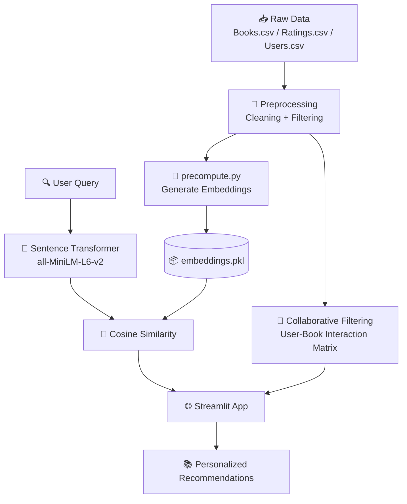

<div align="center">

# 📚 Book Recommendation System

### *Because "you might also like" should actually mean it.*

A state-of-the-art book recommendation engine that blends **Collaborative Filtering** with **Zero-Shot Semantic Search** to deliver highly personalized reading suggestions — recommendations that understand the *vibe* of a book, not just its keywords.

<br>


<br>

[](https://bookrecommendationsystem-mb498lnqpnpkuhnvn7zaln.streamlit.app/)
[](https://github.com/SHALINISAURAV/Book_Recommendation_System)
[](https://shalinisaurav.github.io)
[](https://www.linkedin.com/in/shalini-saurav-649aa22b8/)

</div>

<br>

> 🌱 **A Learning Project.** This repository documents a hands-on journey into hybrid recommendation systems — built to *learn by building*, not as a polished commercial product. Bugs, experiments, and "aha" moments are all part of the story. Feel free to explore, fork, and learn alongside it.

---

## 📑 Table of Contents
- [Problem Statement](#-problem-statement)
- [Why This Project?](#-why-this-project)
- [The Learning Journey](#-the-learning-journey)
- [Solution Approach](#-solution-approach)
- [System Architecture](#️-system-architecture)
- [Tech Stack](#️-tech-stack)
- [Project Structure](#-project-structure)
- [Installation & Usage](#️-installation--usage)
- [Data Pipeline & Model](#-data-pipeline--model)
- [Challenges & Engineering Decisions](#-challenges--engineering-decisions)
- [Learning Outcomes](#-learning-outcomes)
- [Future Improvements](#-future-improvements)
- [Author & Contact](#-author--contact)

---

## 🎯 Problem Statement

In an era of information overload, finding books that truly align with a user's taste is challenging. Traditional systems often rely on simple keyword matching, which fails to capture the semantic nuances or the "vibe" of a book. This project addresses the challenge of providing discovery-based recommendations using both user behavior and semantic understanding.

---

## 🌟 Why This Project?

Recommendation engines are everywhere, but most treat books as bags of keywords — "if you liked *Dune*, here's everything else with the word 'sand' in the blurb." That's not discovery, that's noise. This project was built to do better: to combine what *readers with similar taste* actually enjoyed with what a book *semantically means*, so the system can say "you might like this" and actually be right.

> *A good recommendation doesn't just match your history — it understands your taste.*

---

## 🌱 The Learning Journey

This project started as a simple question: *can a recommendation system understand meaning, not just co-occurrence?* What followed was a hands-on deep dive into two very different worlds of recommendation science — the statistical world of collaborative filtering, and the semantic world of transformer embeddings — and the messy, rewarding process of stitching them together into something that actually works in production.

Along the way, this project became a personal playground for exploring:

- 🧠 How **semantic embeddings** actually capture meaning, not just word overlap
- 🤝 How **collaborative filtering** turns anonymous rating patterns into taste profiles
- ⚙️ What it really takes to move a notebook experiment into a **stable, deployed app**
- 🐛 How much of "machine learning engineering" is actually **debugging memory, latency, and dependencies**

It's not meant to be the final word on book recommendations — it's a snapshot of learning in motion, and every future commit will keep building on it.

---

## 💡 Solution Approach

This project uses a **hybrid approach**, combining two fundamentally different recommendation strategies:

### 1️⃣ Collaborative Filtering
Uses user-book interaction matrices to identify patterns among users with similar reading histories — the "people like you also enjoyed" signal.

### 2️⃣ Zero-Shot Semantic Search
Leverages pre-trained Transformer models (`all-MiniLM-L6-v2`) to perform semantic embedding. This allows the system to understand the *context and meaning* of a query without needing task-specific training — a true **Zero-Shot** capability.

Together, these two approaches cover each other's blind spots: collaborative filtering captures community taste, while semantic search captures meaning even for books with sparse interaction data.

---

## 🏗️ System Architecture

- **📥 Data Layer:** Raw CSV ingestion (Books, Ratings, Users)
- **⚙️ Processing Layer:** `precompute.py` generates vector embeddings
- **🧠 Inference Layer:** `app.py` handles user queries, computes cosine similarity, and renders results via Streamlit



---

## 🛠️ Tech Stack

| Category | Tools |
|---|---|
| **Language** | Python 3.12 |
| **Frameworks** | Streamlit (Frontend/Deployment) |
| **ML/AI** | Scikit-Learn (Cosine Similarity), Sentence-Transformers (BERT) |
| **Data Handling** | Pandas, NumPy |
| **Versioning** | Git, GitHub |

---

## 📂 Project Structure

```text
BOOK_RECOMMENDATION_SYSTEM/
├── .vscode/               # Workspace settings
├── app.py                 # Core application logic
├── precompute.py          # Embedding generation script
├── Books.csv               # Book metadata
├── Ratings.csv             # User interaction data
├── Users.csv               # User demographics
├── embeddings.pkl          # Pre-computed semantic vectors
├── requirements.txt        # Dependencies
└── README.md               # Documentation
```

---

## ⚙️ Installation & Usage

### 1️⃣ Clone the Repository

```bash
git clone https://github.com/SHALINISAURAV/Book_Recommendation_System.git
cd Book_Recommendation_System
```

### 2️⃣ Install Requirements

```bash
pip install -r requirements.txt
```

### 3️⃣ Run the App

```bash
streamlit run app.py
```

🎉 The app will be live at `http://localhost:8501`

---

## 📊 Data Pipeline & Model

| Stage | Details |
|---|---|
| 🧹 **Preprocessing** | Cleaned data using Pandas, handling missing values and filtering for statistically significant book/user interactions (min 50 ratings) |
| 🧬 **Embeddings** | Generated high-dimensional vectors for book titles, capturing semantic relationships |
| 📐 **Similarity** | Used `cosine_similarity` to measure the distance between the query vector and existing book vectors in the latent space |

---

## 🚧 Challenges & Engineering Decisions

| Challenge | Decision |
|---|---|
| 💾 App instability due to high memory usage | Implemented `@st.cache_data` and `low_memory=False` to handle large CSV files |
| 🐢 High latency during search | Decoupled model loading from the main loop; used `@st.cache_resource` to load the BERT model once |
| 🍎 Dependency conflicts with `torchvision` on macOS | Explicitly pinned versions in `requirements.txt` to ensure build stability on Streamlit Cloud |

Each of these was a real production hurdle, and each one taught something no tutorial could — solving them turned a fragile prototype into a stable, deployable application, and turned "it works on my machine" into "it works, period."

---

## 🎓 Learning Outcomes

- 🧬 Deepened understanding of Vector Embeddings and the utility of Zero-Shot Learning in recommendation systems
- 🤝 Learned how collaborative filtering and semantic search complement each other in a hybrid pipeline
- 🏗️ Mastered productionizing ML models using Streamlit
- 🐞 Gained efficiency in debugging complex deployment environments
- 📦 Understood the real-world tradeoffs of caching, memory management, and dependency pinning
- 🧭 Built confidence navigating the gap between "it works in a notebook" and "it works in production"

---

## 🚀 Future Improvements

- [ ] ⚡ **FAISS Integration** — Implement Facebook AI Similarity Search for faster retrieval on massive datasets
- [ ] 🔐 **User Authentication** — Allow users to save custom "Reading Lists"
- [ ] 🧩 **Advanced Filtering** — Integrate hybrid models to combine content-based and collaborative data
- [ ] 🌍 Multi-language book support
- [ ] 📱 Mobile-optimized UI
- [ ] 🗣️ Natural-language query interface ("recommend me something like *Project Hail Mary* but shorter")
- [ ] 📊 A/B testing framework to compare collaborative vs. semantic recommendation quality
- [ ] 🧠 Fine-tuning the embedding model on book-specific data for sharper semantic matches

---

## 👤 Author & Contact

<div align="center">

**Shalini Saurav**

Aspiring AI/ML Engineer — learning in public, one project at a time.

[](https://github.com/SHALINISAURAV/Book_Recommendation_System)
[](https://shalinisaurav.github.io)
[](https://www.linkedin.com/in/shalini-saurav-649aa22b8/)

<br>

*Made with ❤️ (and a lot of debugging) by Shalini Saurav*

### ⭐ If you found this project useful or you're on a similar learning journey, consider giving it a star on GitHub!

</div>
